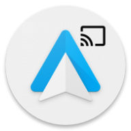
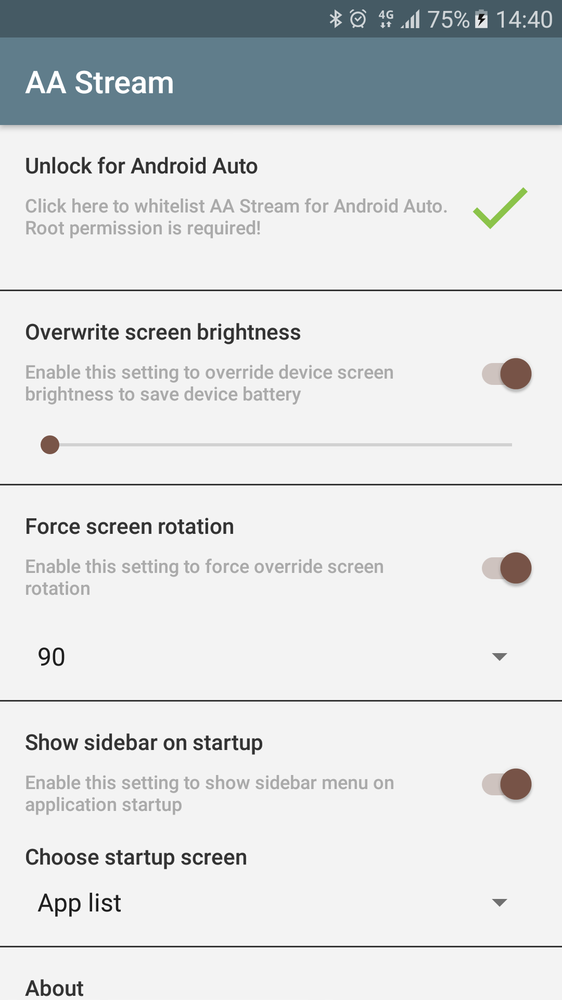

# AA Stream
 
## About
**AA Stream** is an unofficial and unsupported device screen mirroring application inspired by [AAMirror](https://github.com/slashmax/AAMirror) for Android Auto. 

**Use it with causion! I don't take any responsibility for the missuse of the application. You have been warned.**

## Prerequisites and usage
#### To use this application:
- Your device has to be **rooted** (You have to figure out how to do it for yourself).
- Android Auto must be installed, preferably an older version (~v3).
- Write System settings must be granted (Enable the switch for **AA Stream** once prompted) to use brightness and rotation features.
- Screen Capture permission granted (Allow it when prompted).

#### Enable Developer Mode in Android Auto.
- Install and open the `Android Auto` App
- Select the `About` section from menu.
- Click the Header `About Android Auto` a few times, until the dev mode is turned on.
- Click the `Menu` (3 dots) buutton and open `Developer Settings`.
- Set the `Application Mode` to `Developer`.
- Scroll down and ensure `Unknown sources` is checked.

#### Whitelist AA Stream for Android Auto
- Open **AA Stream**.
- Click on `Unlock for Android Auto`.
- If green checkmark and a Toast message with success is shown - you are good to go. (If not - ensure your device is rooted).
- Restart device for the changes to take effect.
- Connect the device to your car and select **AA Stream** from all apps menu (Last icon on the right in cars display), if **AA Stream** is not there, redo the steps.

## Credits
- Inspired by: [AAMirror](https://github.com/slashmax/AAMirror)
- Whitelist queries taken from: [AA-Phenotype-Patcher](https://github.com/Eselter/AA-Phenotype-Patcher)
- Wouldn't be possible without: [AAuto-SDK](https://github.com/martoreto/aauto-sdk)

## Settings Activity guide

- **Unlock for Android Auto**
  - Click here to whitelist **AA Stream** for Android Auto. Root permission is required!
  - **AA Stream** is successfully unlocked if a green chekmark is visible.
- **Overwrite screen brightness**
  - Enable this setting to override device brightness when **AA Stream** is started from Android Auto.
  - Use this to save device battery as the device screen needs to be always on to mirror it in cars display.
- **Force screen rotation**
  - Enable this setting to force the device screen to be rotated to predefined degrees (0, 90, 180, 270).
  - Use this to start apps in landscape mode (If the app supports it).
- **Show sidebar on startup**
  - Enable this to show sidebar menu on **AA Stream** startup.
  - Choose which menu option should be shown when sidebar is opened.
  - Set it to `Favorites` to show your favorited apps (To favorite and unfavorite an app from app list, press and hold the app icon for few seconds).
- **About**
  - Click on the app icon for 10 times to enable debug mode.
  - This adds a new option in car display to see the logs of the app.
